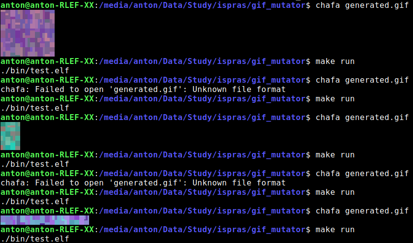
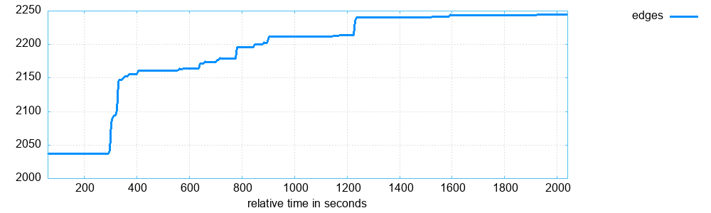
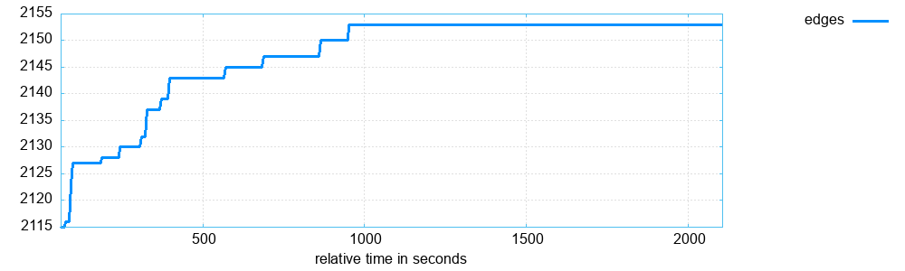

# Fuzzing GIF

Тестовое задание в отдел фаззинга ИСП РАН

## Оглавление

+ [Постановка задачи](#постановка-задачи)
+ [Фаззинг проекта TIMG, Fail](#фаззинг-проекта-timg-fail)
+ [Фаззинг проекта Chafa, Success](#фаззинг-проекта-сhafa-success)
    + [Базовый Фаззинг](#41-часть-установка-и-базовый-фаззинг)
    + [Кастомная мутация](#42-часть-создание-своей-мутации-для-gif)
    + [Тесты](#43-часть-тесты)
    + [Параллельный фаззинг](#44-часть-параллельный-фаззинг)
    + [Сравнения и выводы](#45-часть-сравнения-и-выводы)
+ [Ошибки и материалы](#ошибки-и-материалы)

## Постановка задачи

**Задача:**
Собранный бинарь (таргет), который ты будешь фаззить - должен принимать на вход данные определённого формата.

- Набрать качественный корпус входных данных.
Т.е. входные файлы должны соответствовать формату, который таргет принимает на вход.

- Написать и применить кастомную мутацию

В фаззере AFL++ есть такая возможность. Нужно написать мутацию, которая учитывая формат входных данных, принимаемый анализируемой программы, поддерживает 2 режима работы и применяет их (может быть один первый режим если он позволяет достичь прироста путей):
1) Сохранение формата входных данных после мутаций фаззера
2) Мутация входных данных с учетом формата входных данных (комбинация 
токенов и прочее)

Этот таргет нужно профаззить фаззером AFL++.

Нужно запустить 2+ процессов afl-fuzz и обеспечить синхронизацию между ними.
Необходимо убедиться, что есть прирост найденных путей.

## Фаззинг проекта [TIMG](https://github.com/hzeller/timg), Fail

Выбранная программа [TIMG](https://github.com/hzeller/timg) , формат файла `*.gif`.

Ход работы:
1. Собрал TIMG и посмотрел функционал.
2. Пересборка проекта с помощью CMake с добавлением AFL++:
Добавлено в CMakeLists.txt проекта TIMG:
```bash
set(CMAKE_C_COMPILER afl-clang-fast)
set(CMAKE_CXX_COMPILER afl-clang-fast++)
message(STATUS ">>> CMAKE_C_COMPILER: ${CMAKE_C_COMPILER}")
message(STATUS ">>> CMAKE_CXX_COMPILER: ${CMAKE_CXX_COMPILER}")
```

3. В отдельной папке организую фаззинг.

Собрал корпус входных `*.gif` файлов и подключил соответственный стандартный словарь от aflpp. Запускаю aflpp(прохожу исправление всех ошибок).

```bash
export AFL_I_DONT_CARE_ABOUT_MISSING_CRASHES=1
export AFL_SKIP_CPUFREQ=1
afl-fuzz -i input -o output -x ~/AFLplusplus/dictionaries/gif.dict -- /usr/local/bin/timg @@
```


Первый вывод: ошибка (odd, check syntax) и levels = 1 - фаззер не может пройти в глубину, решил посмотреть, где он останавливается:
Пробую применить `afl-watsup`:

```bash
afl-whatsup -s output/
```

Ничего не дало.

Пробую применить `afl-plot`:

```bash
afl-plot output/default plot
```

Ничего не дало.

Пробую применить `afl-showmap`:

Показало, что дальше 20 вершин я не могу проникнуть по какой-то причине.

Пытаюсь применить [`afl-cov`](https://github.com/vanhauser-thc/afl-cov/tree/master)([установка](https://www.programmerall.com/article/96432444283/)): 

Пересобрал TIMG с подключением `gcov`: 

В CMakeLists.txt timg добавил и изменил компилятор на afl-gcc-fast после скомпилил и установил:
```cpp
set (CMAKE_CXX_COMPILER afl-g++-fast)
set (CMAKE_C_COMPILER afl-gcc-fast)
set (CMAKE_CXX_FLAGS "${CMAKE_CXX_FLAGS} -fprofile-arcs -ftest-coverage")
set (CMAKE_C_FLAGS   "${CMAKE_C_FLAGS}   -fprofile-arcs -ftest-coverage")
set (CMAKE_EXE_LINKER_FLAGS "${CMAKE_EXE_LINKER_FLAGS} -lgcov")
```
Разместил в папке `./output/default/queue/` - свои хорошие примеры для дебага. Afl-cov скрипт считывает файлы оттуда и затем создает в месте бинарников файлы .gcda о покрытии. 

Запуск:

```bash
~/afl-cov/afl-cov -d ./output --overwrite --code-dir ~/timg/build/src/CMakeFiles/timg.dir --coverage-cmd "cat AFL_FILE | LD_LIBRARY_PATH=~/timg/build/src/CMakeFiles/timg.dir /usr/local/bin/timg AFL_FILE -g100x100"
```

Чтобы получить правильный вывод понадобилось 2 дня дебагга питоновского скрипта afl-cov который вызывал из под себя криво `lcov`.  Получал ошибку `Did not find any AFL test cases, exiting.`

Пришлось в установленном afl-cov пайтон скрипте искать проблему - оказалось при обработке оно считывало все файлы из default/queue/ с маской `id:000000` НО afl генерит файлы `id_000000` из-за этого он не мог считать ни одного файла. Поправил в самом коде, далее пришлось смотреть какие команды он вызывает и как объединяет файлы для lcov. Делал он это запуская 
`cat ./output/default/queue/id_000001 | timeout -s KILL 5 cat ./output/default/queue/id_000001 | LD_LIBRARY_PATH=~/timg/build/src/CMakeFiles/timg.dir /usr/local/bin/timg ./output/default/queue/id_000001 -g100x100` - треш. Поэтому подогнал параметры строки и запускал все с исходниками в непосредственном месте билда. 

P.S. Потом я понял откуда возникла эта ошибка, при настройке AFL была ошибка о невозможности создания файлов `id:000000` и поэтому решение было включить опцию `#define SIMPLE_FILES` из-за этого хода скрипт afl-cov не сработал.

После всех изменений запускаю afl-cov с одним мутировавшим кривым gif:


В этот момент стало понятно, что надо было это проверять через IDA, а еще лучше взять другой проект для фаззинга, чтобы вернуться к изначальному заданию :cry: . 

Несмотря на это было знакомство с cmake и afl-cov.

## Фаззинг проекта [Сhafa](https://github.com/hpjansson/chafa), Success

## 4.1. Часть (Установка и базовый фаззинг)

Нужно было выбрать проект, работающий с командной строкой, без графического интерфейса(для простоты) и принимающий `*.gif`. Для этого я искал программы по типу TIMG, т.е. те которые могут выводить изображение в терминал, отдельная проблема с gif - не самый удобный. Нашел [подборку](https://www.linuxlinks.com/best-free-open-source-terminal-based-image-viewers/) из которой выбрал [chafa](https://github.com/hpjansson/chafa?tab=readme-ov-file)(tiv был занят)
Поэтому выбран проект [chafa](https://github.com/hpjansson/chafa?tab=readme-ov-file) и тип файлов `*.gif`

1. Собрал проект и запустил 


2. Сборка с afl++: для компиляции используется сначала `./autogen.sh` затем множество вложенных `Makefile`. В каждом определен `CC=gcc`, поэтому в make добавляю `make --environment-overrides CC=afl-gcc-fast`. И продолжаю установку.

> `*.gif` может иметь несколько картинок подряд которые могут проигрываться с анимацией. Из-за этого нужно добавлять критерии выполнения иначе будет превышение лимита по времени. После изучения параметров chafa решил выключить анимацию `--animate=off`.

## 4.2. Часть (Создание своей мутации для `.gif`)

Чтобы увеличить эффективность фаззинга, нужно разобраться с типом входных данных и учесть мутацию конкретно для моего типа, т.е. `.gif`.

Поэтому нужно создать [кастомную мутацию](https://github.com/AFLplusplus/AFLplusplus/blob/stable/docs/custom_mutators.md) для AFL++ на основе `gif`. 

Для изучения внутренности `gif` использую статьи:

+ https://habr.com/ru/articles/274917/
+ https://habr.com/ru/articles/127083/
+ https://habr.com/ru/companies/tradingview/articles/184660/
+ https://www.matthewflickinger.com/lab/whatsinagif/bits_and_bytes.asp
+ https://www.matthewflickinger.com/lab/whatsinagif/lzw_image_data.asp

Для создания мутаций смотрю:

+ https://github.com/google/fuzzing/blob/master/docs/structure-aware-fuzzing.md - доки по мутациям от LibFuzzer с примером png
+ https://github.com/AFLplusplus/AFLplusplus/blob/stable/docs/custom_mutators.md - доки по мутациям от AFL++ с примером как использовать.

**Формат GIF:**


*Простыми словами:* файл в формате [GIF](https://ru.wikipedia.org/wiki/GIF) состоит из фиксированной области в начале файла, за которой располагается переменное число блоков, и заканчивается файл завершителем изображения.

*На деле:* в нем есть области которые задают общие параметры изображения, параметры анимации и еще очень много параметров. Есть глобальная таблица цветов, локальная(опционально) а также данные изображения. 

Самая интересная область это Image Data это информация об изображении(состояниях пикселей), которая хранится в виде блоков байтов.

Этот блок байт - результат сжатия LZW алгоритмом изначального блока цветов(последовательности индексов цветов 1,2,0,0,...).

**Моя мутация:**

Моя первая мутация генерирует GIF файл, при этом файл может быть валидным или нет.

В нем случайным образом генерятся размеры холста, сдвиги слоя, кол-во картинок для анимации, цвета и данные изображение. 

При этом данные изображения генерятся изначально в виде последовательности индексов цвета, а затем сжимаются по LZW алгоритму(сделал упрощенную его реализацию по [статье](https://www.matthewflickinger.com/lab/whatsinagif/lzw_image_data.asp)). Поэтому несмотря на рандомизацию многих параметров, данные изображения всегда будут валидными! 

Но в комбинации результат получается очень интересным и разнообразным(на фото запуск chafa с сгенеренным файлом) от бесконечной гифки до пустого места/failed to open.



Поэтому такая генерация изображений вместе с мутациями AFL++ увеличивает разнообразие входных файлов для программы

Моя вторая мутация берет входящий файл и добавляет в конец его рандомным образом различные блоки формата GIF.

Это позволяет мутировать текущий входящий файл.

`gif_generator.c`,`gif_generator.h` - генерирует буфер с содержимым GIF файла, включает в себя рандомизацию добавления необязательных расширений, а так же сами характеристики изображения и его данные.

`gif_lzw_encode.c`,`gif_lzw_encode.h` - содержит немного упрощенную реализацию сжатия данных по LZW алгоритму. Используется в генераторе GIF

`main.txt` - для дебагга генератора

+ `mutation1.c` - подключает AFL и содержит стандартные функции кастомного мутатора. Вызывает генератор GIF
+ `mutation2.c` - подключает AFL и содержит стандартные функции кастомного мутатора. Добавляет блоки GIF формата во входные данные.

`Makefile` - имеет цели для сборки мутации и для обычной компиляции(для дебагга).Сборка с помощью цели `make mutation`

**Пример генерации GIF файлов моим мутатором во время фаззинга:**


## 4.3. Часть (Тесты)

С разными опциями фазжу проект в течении ~35 мин

Затем строю графики в `afl-plot`: `afl-plot output_N/default output_N/plot` - там есть все построенные графики

Результаты находятся в `./chafa/output_N`, папки `default` и `plot`

**Фаззинг с обычными мутациями:**

```bash
export AFL_I_DONT_CARE_ABOUT_MISSING_CRASHES=1
export AFL_SKIP_CPUFREQ=1
export AFL_MAP_SIZE=65535
afl-fuzz -i input -o output_1 -- /usr/local/bin/chafa --animate=off @@
```



**Фаззинг только с кастомной мутацией:**

```bash
export AFL_I_DONT_CARE_ABOUT_MISSING_CRASHES=1
export AFL_SKIP_CPUFREQ=1
export AFL_MAP_SIZE=65535
export AFL_CUSTOM_MUTATOR_ONLY=1
export AFL_CUSTOM_MUTATOR_LIBRARY="../gif_mutation1.so;../gif_mutation2.so"
afl-fuzz -i input -o output_2 -- /usr/local/bin/chafa --animate=off @@
```



**Фаззинг с дефолтной + кастомной мутацией:**

```bash
export AFL_I_DONT_CARE_ABOUT_MISSING_CRASHES=1
export AFL_SKIP_CPUFREQ=1
export AFL_MAP_SIZE=65535
export AFL_CUSTOM_MUTATOR_LIBRARY="../gif_mutation1.so;../gif_mutation2.so"
afl-fuzz -i input -o output_3 -- /usr/local/bin/chafa --animate=off @@
```


## 4.4. Часть (Параллельный фаззинг)

В первом терминале запускаю главный процесс `-M`:
```bash
afl-fuzz -i input -o output_4 -M fuzzer01 -x ~/AFLplusplus/dictionaries/gif.dict -- /usr/local/bin/chafa --animate=off @@ 
```
В других вторичные процессы `-S`:
```bash
afl-fuzz -i input -o output_4 -S fuzzer02 -- /usr/local/bin/chafa --animate=off @@ 
afl-fuzz -i input -o output_4 -S fuzzer03 -x ~/AFLplusplus/dictionaries/gif.dict -- /usr/local/bin/chafa --animate=off @@ 
afl-fuzz -i input -o output_4 -S fuzzer04 -- /usr/local/bin/chafa --animate=off @@ 
```
> В главном процессе включаю свою мутацию, словарь и хаотичные
> 
> В первом вторичном - только свою мутацию `export AFL_CUSTOM_MUTATOR_ONLY=1`
>
> Во втором вторичном - только словарь
>
> В третьем вторичном - только хаотичные мутации


## 4.5. Часть (Сравнения и выводы)

Сравнивая графики зависимости кол-ва покрытых вершин от времени можно сказать, что кастомная мутация в одиночку не покрывает столько же вершин, сколько хаотичные. Но при этом в сочетании с хаотичными мутациями, она дает большой прирост в скорости покрытия на начальном участке, а также имеет преимущество и при длительном фаззинге имея "плато" на большем количестве вершин, чем только хаотичные.

Параллельный фаззинг за время в 4 раза меньше(4 процесса) дал почти тот же результат, даже учитывая, что процессы запускались с разными опциями.

**Итог:** задача по фаззингу выполнена!

## Ошибки и материалы

### AFL

[AFL](https://github.com/google/AFL), [инструкция](https://github.com/google/AFL/blob/master/docs/INSTALL).

**Система**: Linux Mint 21.3 Cinnamon Intel i5-12450H

**Ошибки**:
```bash
[-] Hmm, your system is configured to send core dump notifications to an
    external utility. This will cause issues: there will be an extended delay
    between stumbling upon a crash and having this information relayed to the
    fuzzer via the standard waitpid() API.

    To avoid having crashes misinterpreted as timeouts, please log in as root
    and temporarily modify /proc/sys/kernel/core_pattern, like so:

    echo core >/proc/sys/kernel/core_pattern

[-] PROGRAM ABORT : Pipe at the beginning of 'core_pattern'
         Location : check_crash_handling(), afl-fuzz.c:7347

```
Исправляю, почитав об ошибке [ответ разраба](https://stackoverflow.com/questions/35441062/afl-fuzzing-without-root-avoid-modifying-proc-sys-kernel-core-pattern)(не пользовался AFL_I_DONT_CARE_ABOUT_MISSING_CRASHES [форум](https://groups.google.com/g/afl-users/c/7arn66RyNfg/m/BsnOPViuCAAJ)). 
```bash
sudo su -   
echo core >/proc/sys/kernel/core_pattern
sudo su user
```

```bash
[-] Whoops, your system uses on-demand CPU frequency scaling, adjusted
    between 390 and 4296 MHz. Unfortunately, the scaling algorithm in the
    kernel is imperfect and can miss the short-lived processes spawned by
    afl-fuzz. To keep things moving, run these commands as root:

    cd /sys/devices/system/cpu
    echo performance | tee cpu*/cpufreq/scaling_governor

    You can later go back to the original state by replacing 'performance' with
    'ondemand'. If you don't want to change the settings, set AFL_SKIP_CPUFREQ
    to make afl-fuzz skip this check - but expect some performance drop.

[-] PROGRAM ABORT : Suboptimal CPU scaling governor
         Location : check_cpu_governor(), afl-fuzz.c:7409
```
Исправил с помощью команды.
```bash
[-]  SYSTEM ERROR : Unable to create './findings_dir/queue/id:000000,orig:example1'
    Stop location : link_or_copy(), afl-fuzz.c:2959
       OS message : Invalid argument
```
Исправил по [ответу](https://groups.google.com/g/afl-users/c/oJUGxCUg4Vo) разработчика, переустановил с `#define SIMPLE_FILES`. 

### LibFuzzer и AFL++

LibFuzzer:
+ https://llvm.org/docs/LibFuzzer.html
+ https://github.com/google/fuzzing/tree/master
+ https://github.com/google/fuzzing/blob/master/docs/structure-aware-fuzzing.md
+ https://clang.llvm.org/docs/SourceBasedCodeCoverage.html

AFL++:
+ https://github.com/AFLplusplus/AFLplusplus
+ https://github.com/AFLplusplus/AFLplusplus/blob/stable/docs/fuzzing_in_depth.md
+ https://github.com/AFLplusplus/AFLplusplus/blob/stable/docs/tutorials.md
+ https://habr.com/ru/articles/772156/
